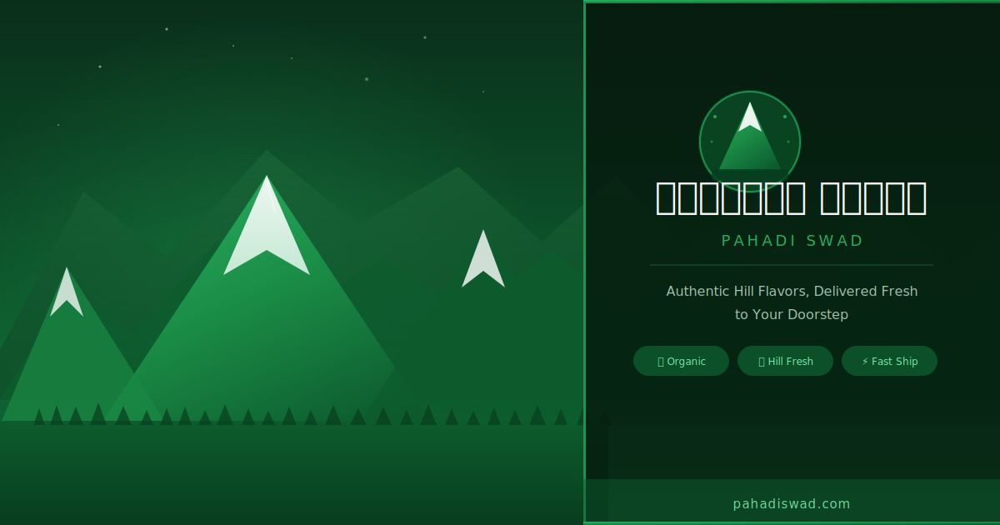

<p align="center">
  
</p>

<h1 align="center">পাহাড়ি স্বাদ — Hill Taste 🏔️</h1>

<p align="center">
  <strong>Authentic Hill Flavors, Delivered Fresh to Your Doorstep</strong><br>
  A full-featured e-commerce platform built with Laravel 12 + Vue 3 + Inertia.js
</p>

<p align="center">
  
  
  
  
  
  
</p>

---

## ✨ Features

- 🛒 **Full E-Commerce** — Product browsing, cart, checkout, order tracking
- 🔍 **Search & Filters** — By category, keyword, and price
- ❤️ **Wishlist** — Save products for later
- 👤 **Account Settings** — Profile, avatar upload, shipping/billing address, password, notification preferences
- 🔐 **Authentication** — Register, login, password reset (Laravel Breeze + Inertia)
- 🎨 **Premium UI** — Dark navbar with animated dropdown, hero slider, testimonials, newsletter
- 📱 **Fully Responsive** — Mobile-first design
- 🌐 **SEO Ready** — Open Graph, Twitter Card, JSON-LD structured data, sitemap.xml
- 🏔️ **Branded** — পাহাড়ি স্বাদ mountain theme throughout
- 🌿 **Bengali + English** — Bilingual UI (bn-BD)

---

## 🛠️ Tech Stack

| Layer | Technology |
|-------|------------|
| Backend | Laravel 12, PHP 8.4 |
| Frontend | Vue 3, Inertia.js, Vite 7 |
| Styling | Tailwind CSS 3 |
| Database | SQLite (dev) / MySQL (prod) |
| Auth | Laravel Breeze |
| Storage | Laravel Storage (local disk) |

---

## 🚀 Local Setup

### Prerequisites
- PHP 8.2+
- Composer
- Node.js 18+
- npm

### Installation

```bash
# 1. Clone the repo
git clone https://github.com/Dev-orko/paharifood.git
cd paharifood

# 2. Install PHP dependencies
composer install

# 3. Install JS dependencies
npm install

# 4. Environment setup
cp .env.example .env
php artisan key:generate

# 5. Run migrations + seed sample data
php artisan migrate --seed

# 6. Create storage symlink (for avatar uploads)
php artisan storage:link

# 7. Build frontend assets
npm run build

# 8. Start development server
php artisan serve
```

Visit: **http://localhost:8000**

### Development (with hot reload)

```bash
# Terminal 1
php artisan serve

# Terminal 2
npm run dev
```

---

## 📂 Project Structure

```
├── app/
│   ├── Http/Controllers/    # AccountController, ProductController, CartController...
│   └── Models/              # User, Product, Category, Order, Cart, Wishlist...
├── database/
│   ├── migrations/          # All table migrations
│   └── seeders/             # CategorySeeder, ProductSeeder
├── resources/
│   ├── js/
│   │   ├── Components/      # Navbar, Footer, HeroSlider, Products...
│   │   ├── Pages/           # Welcome, CartPage, AccountSettings...
│   │   └── composables/     # useCart, useWishlist, useNotification
│   └── views/app.blade.php  # Root Inertia template (SEO meta, JSON-LD)
├── public/
│   ├── favicon.svg          # Branded SVG favicon
│   ├── og-image.svg         # Social preview image (1200x630)
│   ├── sitemap.xml          # SEO sitemap
│   └── robots.txt           # Crawler rules
└── routes/web.php           # All application routes
```

---

## 🗃️ Database

Default: **SQLite** (zero config for dev)

To switch to MySQL, update `.env`:

```env
DB_CONNECTION=mysql
DB_HOST=127.0.0.1
DB_PORT=3306
DB_DATABASE=paharifood
DB_USERNAME=root
DB_PASSWORD=
```

Then run: `php artisan migrate --seed`

---

## 🌐 Deployment

1. Set `APP_ENV=production` and `APP_DEBUG=false` in `.env`
2. Set `APP_URL=https://yourdomain.com`
3. Run `php artisan config:cache && php artisan route:cache && php artisan view:cache`
4. Run `npm run build`
5. Point web server document root to `/public`

---

## 📄 License

MIT License — free to use and modify.

---

<p align="center">Made with ❤️ for the hills of Bangladesh 🏔️</p>

<p align="center">
<a href="https://github.com/laravel/framework/actions"></a>
<a href="https://packagist.org/packages/laravel/framework"></a>
<a href="https://packagist.org/packages/laravel/framework"></a>
<a href="https://packagist.org/packages/laravel/framework"></a>
</p>

## About Laravel

Laravel is a web application framework with expressive, elegant syntax. We believe development must be an enjoyable and creative experience to be truly fulfilling. Laravel takes the pain out of development by easing common tasks used in many web projects, such as:

- [Simple, fast routing engine](https://laravel.com/docs/routing).
- [Powerful dependency injection container](https://laravel.com/docs/container).
- Multiple back-ends for [session](https://laravel.com/docs/session) and [cache](https://laravel.com/docs/cache) storage.
- Expressive, intuitive [database ORM](https://laravel.com/docs/eloquent).
- Database agnostic [schema migrations](https://laravel.com/docs/migrations).
- [Robust background job processing](https://laravel.com/docs/queues).
- [Real-time event broadcasting](https://laravel.com/docs/broadcasting).

Laravel is accessible, powerful, and provides tools required for large, robust applications.

## Learning Laravel

Laravel has the most extensive and thorough [documentation](https://laravel.com/docs) and video tutorial library of all modern web application frameworks, making it a breeze to get started with the framework. You can also check out [Laravel Learn](https://laravel.com/learn), where you will be guided through building a modern Laravel application.

If you don't feel like reading, [Laracasts](https://laracasts.com) can help. Laracasts contains thousands of video tutorials on a range of topics including Laravel, modern PHP, unit testing, and JavaScript. Boost your skills by digging into our comprehensive video library.

## Laravel Sponsors

We would like to extend our thanks to the following sponsors for funding Laravel development. If you are interested in becoming a sponsor, please visit the [Laravel Partners program](https://partners.laravel.com).

### Premium Partners

- **[Vehikl](https://vehikl.com)**
- **[Tighten Co.](https://tighten.co)**
- **[Kirschbaum Development Group](https://kirschbaumdevelopment.com)**
- **[64 Robots](https://64robots.com)**
- **[Curotec](https://www.curotec.com/services/technologies/laravel)**
- **[DevSquad](https://devsquad.com/hire-laravel-developers)**
- **[Redberry](https://redberry.international/laravel-development)**
- **[Active Logic](https://activelogic.com)**

## Contributing

Thank you for considering contributing to the Laravel framework! The contribution guide can be found in the [Laravel documentation](https://laravel.com/docs/contributions).

## Code of Conduct

In order to ensure that the Laravel community is welcoming to all, please review and abide by the [Code of Conduct](https://laravel.com/docs/contributions#code-of-conduct).

## Security Vulnerabilities

If you discover a security vulnerability within Laravel, please send an e-mail to Taylor Otwell via [taylor@laravel.com](mailto:taylor@laravel.com). All security vulnerabilities will be promptly addressed.

## License

The Laravel framework is open-sourced software licensed under the [MIT license](https://opensource.org/licenses/MIT).
